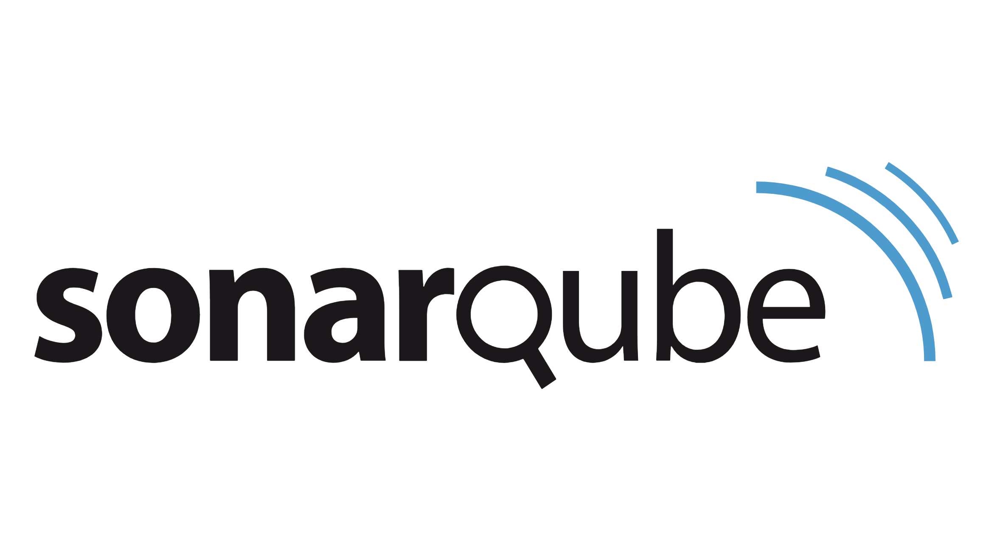

  

<h2>Hello! I'm Abi! 👽</h2>

I'm not just an average Software engineer. I'm an otherworldly being on a mission to help HUMANS. Equipped with advanced extraterrestrial technology, I'm here to explore different dimensions of AI.

With a touch of intergalactic flair, I bring a unique cosmic perspective to the table. I thrive on interstellar knowledge and possess unparalleled expertise in DevOps and Data Analyst field. From unraveling the mysteries of Cloud to navigating the uncharted realms of Super Intelligence👾, I'm all set to venture where no one has gone before.

But hey, it's not all cosmic exploration 🛸 and scientific discoveries📡! When I'm not exploring the cosmos🌌, you can find me engaging in intergalactic arts, tattoos and indulging in alien cuisine. I believe in the power of unity across galaxies and embrace diversity in all forms.

So, let's join forces and embark on an extraordinary journey together. Together, we can transcend boundaries and create a universe of possibilities. Get ready to experience the extraordinary with Abi! 🚀

<h3>Skills</h3>

<table>
    <tr>
        <th>Category</th>
        <th>Skills/Technologies</th>
    </tr>
    <tr>
        <td>Programming/ Scripting Languages/ Web Technologies</td>
        <td>Python, R, PHP, Java, C#, Shell, JavaScript (Node.js), HTML, CSS (React)</td>
    </tr>
    <tr>
        <td>Database</td>
        <td>MySQL, MS SQL Server, MongoDB, DynamoDB, PostgreSQL</td>
    </tr>
    <tr>
        <td>Cloud Platform</td>
        <td>AWS, PCF, Azure, GCP</td>
    </tr>
    <tr>
        <td>SCM Tools</td>
        <td>Bitbucket, GitHub, GitLab, Perforce</td>
    </tr>
    <tr>
        <td>Repository Manager</td>
        <td>jFrog Artifactory, Sonatype Nexus</td>
    </tr>
    <tr>
        <td>Build Tool</td>
        <td>Maven, Gradle</td>
    </tr>
    <tr>
        <td>Containerization</td>
        <td>VMware, Docker, Kubernetes</td>
    </tr>
    <tr>
        <td>Infrastructure as Code</td>
        <td>Terraform, AWS Cloud Formation</td>
    </tr>
    <tr>
        <td>Monitoring Tools</td>
        <td>Datadog, Grafana, Splunk, Dynatrace, Nagios, AWS CloudWatch</td>
    </tr>
    <tr>
        <td>CI/CD Tools</td>
        <td>Jenkins, TeamCity, Gitlab CI, GitHub Actions, CircleCI</td>
    </tr>
    <tr>
        <td>Security and Other Tools/ Technologies</td>
        <td>AWS WAF, AWS Lambda, S3, EC2, VPC, CIDR, IAM, CyberArk, HashiCorp Consul, Postman, Jira, Microservices, Unit testing (JUnit), Static testing (SonarQube), Regression testing (JUnit), Penetration testing (OWASP), Performance testing (JMeter), Load Testing (JMeter), Kafka, Streamsets</td>
    </tr>
    <tr>
        <td>Ticketing Tool</td>
        <td>Zendesk, ServiceNow, HPSM</td>
    </tr>
    <tr>
        <td>Operating System</td>
        <td>Windows, Linux, MacOS</td>
    </tr>
    <tr>
        <td>Machine Learning and Big Data</td>
        <td>Amazon SageMaker, TensorFlow, Scikit-learn, Pytorch, Spark, Hadoop, Data Analytics, Predictive Analytics</td>
    </tr>
    <tr>
        <td>Data Analysis and Visualization</td>
        <td>Power BI, Tableau, IBM SPSS Statistics, Advanced Excel</td>
    </tr>
</table>

 
    
    
    
    
    
    
    
    
    
    
    
    
    
    
    

<h3>AI Projects For Better World</h3>

- [Real-Time Object Detection and Logging Using YOLOv9e](https://github.com/abidikshit/real-time-object-detection-using-yolov9e)
- [Yolov9-VancouverTrafficCongestion](https://github.com/abidikshit/Yolov9-VancouverTrafficCongestion.git)
- [Movie Recommender System](https://github.com/abidikshit/Projects/tree/master/MovieRecommender)

<!-- <h3>Other Projects for hands-on:</h3>

- [Airbnb New York Analysis (2011 -2019)- Data Visualization using R, ShinyR and Tableau](https://github.com/abidikshit/R_Projects/blob/master/ALY6070-CommunicationAndVisualization/FinalProject/ALY6070_G7_FinalProject.pdf)
- [Resume Building Analytics- Sponsored Project by CoverQuick](https://github.com/abidikshit/Python/blob/master/ALY6080-XN_CoverQuick_Project/FinalCoverQuickAnalysis/ALY6080_Final_Report_CoverQuick.pdf)
- [Twitter Sentiment Analysis](https://github.com/abidikshit/Python/blob/master/ALY6110-DataManagementAndBigData/Twitter/ALY6110_FinalProjectMilestone–BasicAnalysisandDashboard.pdf)
- [Online Payment Fraud Detection](https://github.com/abidikshit/Python/blob/master//ALY6040-Data_Mining/FinalProject/ALY6040_OnlineFraudDetection_FinalProject.pdf)
- [Churn modelling in Banking Industry](https://github.com/abidikshit/R_Projects/blob/master/ALY6015-IntermediateAnalytics/FinalProject/ALY6015_Group1_Final_project.pdf) -->

<h3>Competitions</h3>

- [TransLink Deloitte Hackathon 2023 Winner](https://github.com/abidikshit/Projects/tree/master/TransLink_Intelligent_Transport_System)

<h3>Certifications</h3>

- [AWS Certified Solution Architect- Associate](https://www.linkedin.com/feed/update/urn:li:activity:6598586311408476160/?updateEntityUrn=urn%3Ali%3Afs_feedUpdate%3A%28V2%2Curn%3Ali%3Aactivity%3A6598586311408476160%29)
- [Amazon Web Services Machine Learning Essential Training](https://www.linkedin.com/learning/certificates/15ec6fff6c82d70ed4028b3bbf12e75fc477ea04750bc1ed24ff6786fd93b6a8)
- [Power BI Data Modeling with DAX](https://www.linkedin.com/learning/certificates/fd552f0e605ffb9f51c1b4264af282e174d93c76f5ad3bdb3f3a587a4e1b6f5a)
- [Tableau for Data Scientists](https://www.linkedin.com/learning/certificates/3309650a39442d1ee591b9e70e2b5a4f3525b942e08fa31cdd9840c6ef0d0c01?u=74653650)
- [Learning Amazon SageMaker](https://www.linkedin.com/learning/certificates/e0092cbfdf240ed905f45e4bd7f3137be45495803a735cbe87965c770b996ecf)

<h3>Articles Published</h3>

- [The Power of Statistical Tests: A Guide for Researchers 💡](https://www.linkedin.com/posts/abhilash-dikshit_statistics-dataanalysis-research-activity-7109611454793715712-UIaN?utm_source=share&utm_medium=member_desktop)
- [📚 Unlocking Knowledge: Exploring the World of SQL and Databases 📊](https://www.linkedin.com/pulse/top-50-sql-interview-questions-data-analystscientist-role-dikshit)
- [📊 Unlocking Data Insights with Tableau 📈](https://www.linkedin.com/posts/abhilash-dikshit_dataanalysis-tableau-datavisualization-activity-7109284281608261632-RJ1_?utm_source=share&utm_medium=member_desktop)

<h3>Lets Explore The World Of Data</h3>

    

